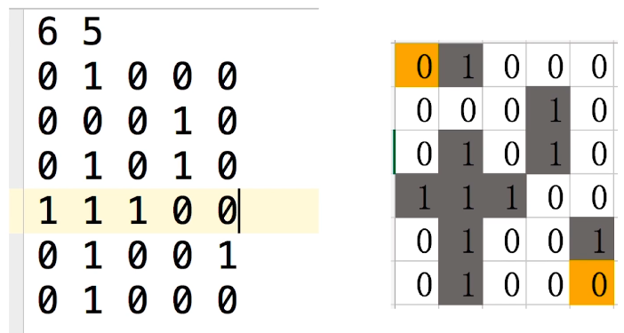

# 7-1 迷宫_算法





# 7-2 迷宫代码实现

```txt
6 5
0 1 0 0 0
0 0 0 1 0
0 1 0 1 0
1 1 1 0 0
0 1 0 0 1
0 1 0 0 0
```


```go
package main

import (
	"fmt"
	"os"
)

func readMaze(filename string) [][]int {
	file, err := os.Open(filename)
	if err != nil {
		panic(err)
	}

	var row, col int
	fmt.Fscanf(file, "%d %d", &row, &col)

	maze := make([][]int, row)
	for i := range maze {
		maze[i] = make([]int, col)
		for j := range maze[i] {
			fmt.Fscanf(file, "%d", &maze[i][j])
		}
	}

	return maze
}

type point struct {
	i, j int
}

var dirs = [4]point{
	{-1, 0}, {0, -1}, {1, 0}, {0, 1}}

func (p point) add(r point) point {
	return point{p.i + r.i, p.j + r.j}
}

func (p point) at(grid [][]int) (int, bool) {
	if p.i < 0 || p.i >= len(grid) {
		return 0, false
	}

	if p.j < 0 || p.j >= len(grid[p.i]) {
		return 0, false
	}

	return grid[p.i][p.j], true
}

func walk(maze [][]int,
	start, end point) [][]int {
	steps := make([][]int, len(maze))
	for i := range steps {
		steps[i] = make([]int, len(maze[i]))
	}

	Q := []point{start}

	for len(Q) > 0 {
		cur := Q[0]
		Q = Q[1:]

		if cur == end {
			break
		}

		for _, dir := range dirs {
			next := cur.add(dir)

			val, ok := next.at(maze)
			if !ok || val == 1 {
				continue
			}

			val, ok = next.at(steps)
			if !ok || val != 0 {
				continue
			}

			if next == start {
				continue
			}

			curSteps, _ := cur.at(steps)
			steps[next.i][next.j] =
				curSteps + 1

			Q = append(Q, next)
		}
	}

	return steps
}

func main() {
	maze := readMaze("lang/maze/maze.in")

	steps := walk(maze, point{0, 0},
		point{len(maze) - 1, len(maze[0]) - 1})

	for _, row := range steps {
		for _, val := range row {
			fmt.Printf("%3d", val)
		}
		fmt.Println()
	}

	// TODO: construct path from steps
}

```

