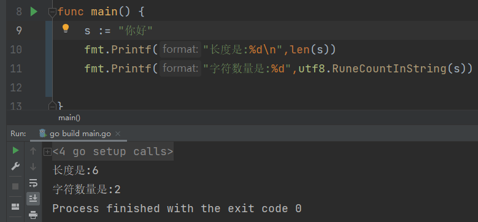

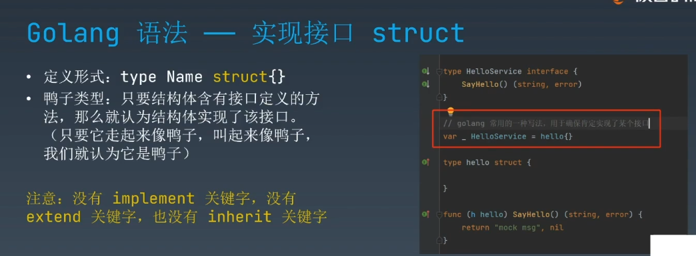

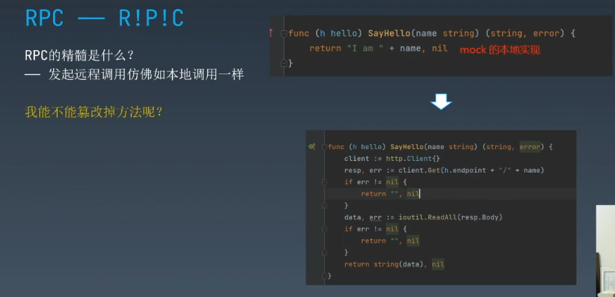


而不是

```go
func (h hello) SayHello(name string) (string, error) {
	client := http.Client{}
	resp, err := client.Get(h.endpoint + name)
	if err != nil {
		log.Fatalf("%s", err)
		return "", err
	}
	data, err := ioutil.ReadAll(resp.Body)
	if err != nil {
		log.Fatalf("%s", err)
		return "", err
	}
	return string(data), nil

}

func (h hello) GetOrder(name string) (string, error) {
	client := http.Client{}
	resp, err := client.Get(h.endpoint + name)
	if err != nil {
		log.Fatalf("%s", err)
		return "", err
	}
	data, err := ioutil.ReadAll(resp.Body)
	if err != nil {
		log.Fatalf("%s", err)
		return "", err
	}
	return string(data), nil

}


```

> HTTP 协议 而 RPC是一种理念

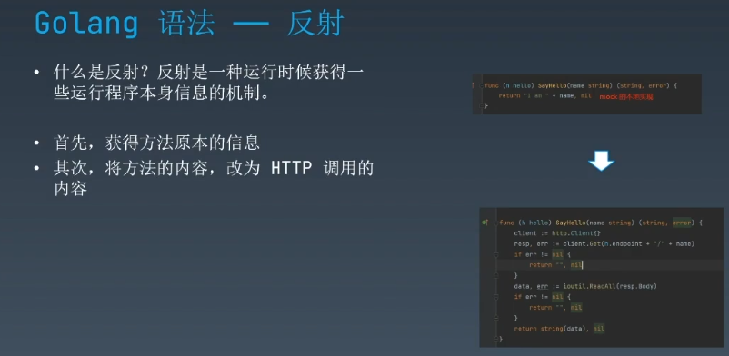


看来我们需要一个指针

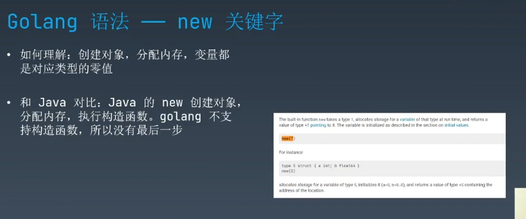

与Java对比,没有构造函数


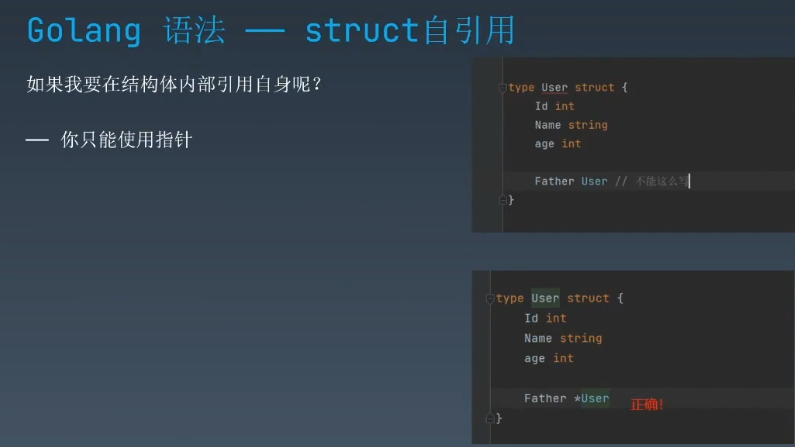

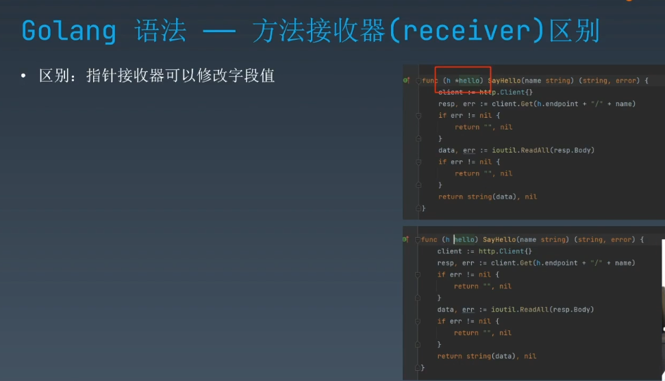

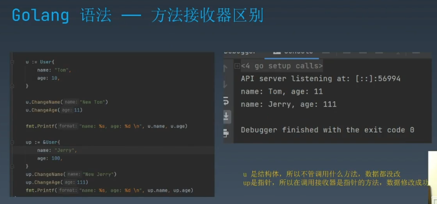


## 不加指针的

```go
package main

import "fmt"

type User struct {
	Name string
	Age  int
}

func (u User) ChangeName(newName string) {
	u.Name = newName
}

func (u User) ChangeAge(newAge int) {
	u.Age = newAge

}

func main() {
	u:=User{
		Name: "TOm",
		Age:  18,
	}

	u.ChangeName("Jerry")
	u.ChangeAge(17)

	fmt.Println(u.Name)
	fmt.Println(u.Age)


}
```

```cmd
TOm
18

Process finished with the exit code 0
```


## 带上指针的

```go
package main

import "fmt"

type User struct {
	Name string
	Age  int
}

func (u *User) ChangeName(newName string) {
	u.Name = newName
}

func (u *User) ChangeAge(newAge int) {
	u.Age = newAge

}

func main() {
	u:=User{
		Name: "TOm",
		Age:  18,
	}

	u.ChangeName("Jerry")
	u.ChangeAge(17)

	fmt.Println(u.Name)
	fmt.Println(u.Age)


}
```

```cmd
Jerry
17

Process finished with the exit code 0
```

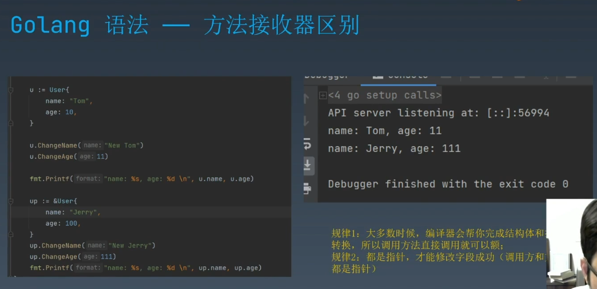

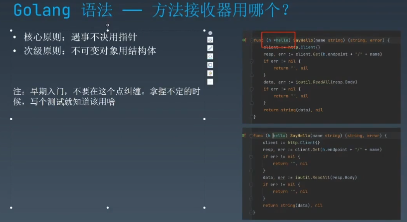

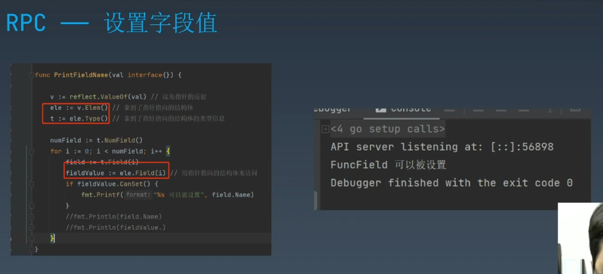

