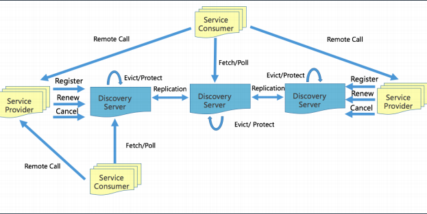

victorfengming.gitee.io/file/pdf/golang/geekbang/camp00/week01.pdf

Go 进阶训练营 

第 1 课 

Go 架构实践 - 微服务(微服务概览与治理) 

毛剑

---

## 服务发现

**服务发现** 

早期我们使用最熟悉的 Zookeeper 作为服务发现， 

但是实际场景是海量服务发现和注册，服务状态可 

以弱一致, 需要的是 AP 系统。 

• 

*分布式协调服务**(**要求任何时刻对* *ZooKeeper**的访问请* 

*求能得到一致的数据，从而牺牲可用性**)**。* 

• 

*网络抖动或网络分区会导致的* *master* *节点因为其他节* 

*点失去联系而重新选举或超过半数不可用导致服务注* 

*册发现瘫痪。* 

• 

*大量服务长连接导致性能瓶颈。* 

我们参考了 Eureka 实现了自己的 AP 发现服务， 

试想两个场景，牺牲一致性，最终一致性的情况： 

• 

*注册的事件延迟* 

• 

*注销的事件延迟*

---

通过 Family(appid) 和 Addr(IP:Port) 定位实例， 

除此之外还可以附加更多的元数据：权重、染 

色标签、集群等。 

*appid:* *使用三段式命名，**business.service.xxx* 

• Provider 注册后定期(30s)心跳一次，注册， 

心跳，下线都需要进行同步，注册和下线需要 

进行长轮询推送。 

*新启动节点，需要* *load cache**，**JVM* *预热。* 

*故障时，**Provider* *不建议重启和发布。* 

• Consumer 启动时拉取实例，发起30s长轮询。 

*故障时，需要* *client* *侧* *cache* *节点信息。* 

• Server 定期(60s) 检测失效(90s)的实例，失效 

则剔除。短时间里丢失了大量的心跳连接(15 

分钟内心跳低于期望值*85%)，开启自我保护， 

保留过期服务不删除。

