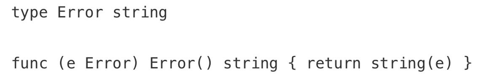

# 目录

•Error Type

•Handling Error

•Go 1.13 errors

•Go 2 Error Inspection

•References

---

Struct Type Error这个是不会打印的

因为在栈上new的两个对象,他们是不同的(地址)

从我们的设计上,来避免一些情况,比如error的string内容相等的情况

 这个时候就会相等了

因为重写了这个NewError

这样还是会导致意外的 判定相等

这样也是不行的

---

各个语言的演进历史：

•C

  *单返回值，一般通过传递指针作为入参，返回值为* *int* *表示成功还是失败。*

•C++

  *引入了 exception，但是无法知道被调用方会抛出什么异常。*

•Java

  *引入了* *checked exception，**方法的所有者必须申明，调用者必须处理。在启动时抛出大量的异常是司空见惯的事情，并在它们的调用堆栈中尽职地记录下来。Java 异常不再是异常，而是变得司空见惯了。它们从良性到灾难性都有使用，异常的严重性由函数的调用者来区分。*

---

#      **Error vs Exception**  

Go 的处理异常逻辑是不引入 exception，支持多参数返回，所以你很容易的在函数签名中带上实现了 error interface 的对象，交由调用者来判定。

*如果一个函数返回了* *(value, error)**，你不能对这个* *value* *做任何假设，必须先判定* *error**。唯一可以忽略* *error* *的是，如果你连* *value* *也不关心。*

Go 中有 panic 的机制，如果你认为和其他语言的 exception 一样，那你就错了。当我们抛出异常的时候，相当于你把 exception 扔给了调用者来处理。

*比如，你在* *C++* *中，把* *string* *转为* *int**，如果转换失败，会抛出异常。或者在* *Java* *中转换* *String* *为* *Date* *失败时，会抛出异常。*

*Go panic* *意味着* *fatal error**（就是挂了）。不能假设调用者来解决* *panic**，意味着代码不能继续运行。*

使用多个返回值和一个简单的约定，Go 解决了让程序员知道什么时候出了问题，并为真正的异常情况保留了 panic。

## 演示

---

异常和错误是两种情况

错误是可以处理的

异常是不可恢复的一种情况

---

对于真正意外的情况，那些表示不可恢复的程序错误，例如索引越界、不可恢复的环境问题、栈溢出，我们才使用 panic。对于其他的错误情况，我们应该是期望使用 error 来进行判定。

You only need to check the error value if you care about the result. -- Dave

This [blog post ](https://devblogs.microsoft.com/oldnewthing/?p=36693)from Microsoft’s engineering blog in 2005 still holds true today, namely:

My point isn’t that exceptions are bad. My point is that exceptions are too hard and I’m not smart enough to handle them.

•简单

•考虑失败，而不是成功（plan for failure, not success）

•没有隐藏的控制流

•完全交给你来控制 error

•Error are values

> 作者自谦: exception 这种情况比较难,以至于我不会更聪明的处理它,所以我们go里面用 panic和error

比如上面的代码,在AddToLeague(guy)这行如果报错, Exception 会出现

就会有这种场景: 一个guy他加入了这个联盟,但是你在 查看Team的时候蹦掉了

所以在用error这种方式,能尽可能的避免这种情况,因为goer 鼓励你做 及时的处理

# Error Type

预定义的特定错误，我们叫为 sentinel error，这个名字来源于计算机编程中使用一个特定值来表示不可能进行进一步处理的做法。所以对于 Go，我们使用特定的值来表示错误。

if err == ErrSomething { … }

类似的 io.EOF，更底层的 syscall.ENOENT。

*使用 sentinel 值是最不灵活的错误处理策略，因为调用方必须使用* *==* *将结果与预先声明的值进行比较。当您想要提供更多的上下文时，这就出现了一个问题，因为返回一个不同的错误将破坏相等性检查。*

*甚至是一些有意义的* *fmt.Errorf* *携带一些上下文，也会破坏调用者的* *==* *，调用者将被迫查看 error**.Error()* *方法的输出，以查看它是否与特定的字符串匹配。*

•不依赖检查 error.Error 的输出。

  *不应该依赖检测* *error.Error* *的输出，**Error* *方法存在于* *error* *接口主要用于方便程序员使用，但不是程序（编写测试可能会依赖这个返回）。这个输出的字符串用于记录日志、输出到* *stdout* *等。*

•Sentinel errors 成为你 API 公共部分。

  *如果您的公共函数或方法返回一个特定值的错误，那么该值必须是公共的，当然要有文档记录，这会增加 API 的表面积。*

  *如果 API 定义了一个返回特定错误的* *interface**，则该接口的所有实现都将被限制为仅返回该错误，即使它们可以提供更具描述性的错误。*

  *比如* *io.Reader**。像* *io.Copy* *这类函数需要* *reader* *的实现者比如返回* *io.EOF* *来告诉调用者没有更多数据了，但这又不是错误。*

•Sentinel errors 在两个包之间创建了依赖。

  *sentinel* *errors* *最糟糕的问题是它们在两个包之间创建了源代码依赖关系。例如，检查错误是否等于 io.EOF，您的代码必须导入 io 包。这个特定的例子听起来并不那么糟糕，因为它非常常见，但是想象一下，当项目中的许多包导出错误值时，存在耦合，项目中的其他包必须导入这些错误值才能检查特定的错误条件（**in the form of an import loop**）。*

•结论: 尽可能避免 sentinel errors。

  *我的建议是避免在编写的代码中使用 sentinel* *errors**。在标准库中有一些使用它们的情况，但这不是一个您应该模仿的模式。*

> 你的接口表面积越大,你的抽象就越脆弱

----

总结一下就是 : error 尽量少暴露 , 然后尽量能尽快的处理 

# Handling Error

if err != nil{

​	

}

从顶层到底层,底层报错,返回err,顶层拿不到 报错行数

