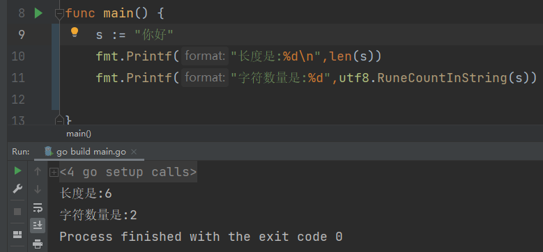

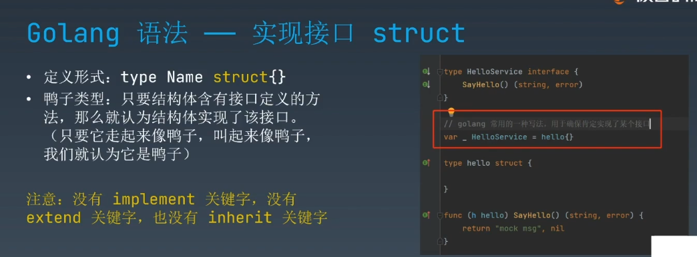

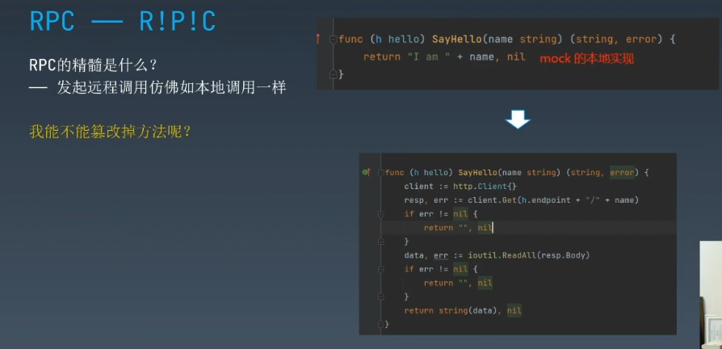


而不是

```go
func (h hello) SayHello(name string) (string, error) {
	client := http.Client{}
	resp, err := client.Get(h.endpoint + name)
	if err != nil {
		log.Fatalf("%s", err)
		return "", err
	}
	data, err := ioutil.ReadAll(resp.Body)
	if err != nil {
		log.Fatalf("%s", err)
		return "", err
	}
	return string(data), nil

}

func (h hello) GetOrder(name string) (string, error) {
	client := http.Client{}
	resp, err := client.Get(h.endpoint + name)
	if err != nil {
		log.Fatalf("%s", err)
		return "", err
	}
	data, err := ioutil.ReadAll(resp.Body)
	if err != nil {
		log.Fatalf("%s", err)
		return "", err
	}
	return string(data), nil

}


```

> HTTP 协议 而 RPC是一种理念

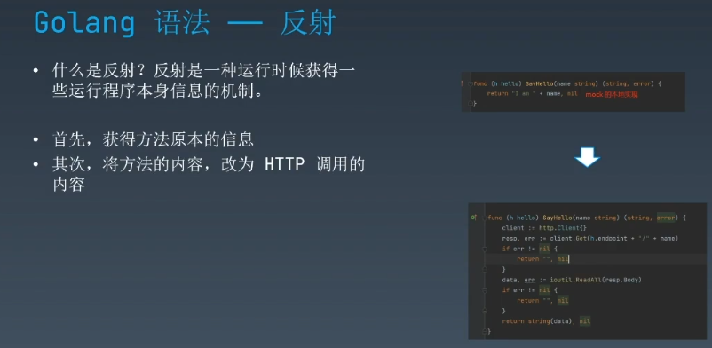


看来我们需要一个指针

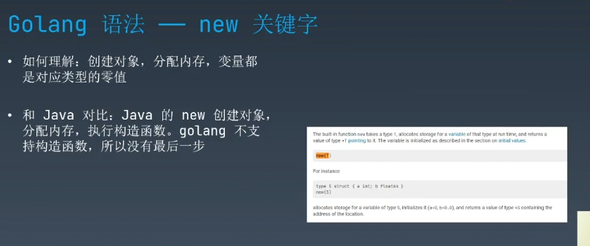

与Java对比,没有构造函数


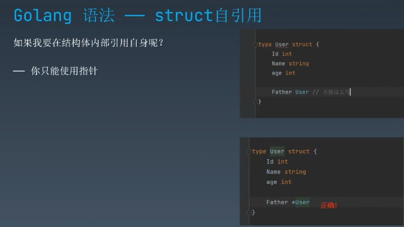

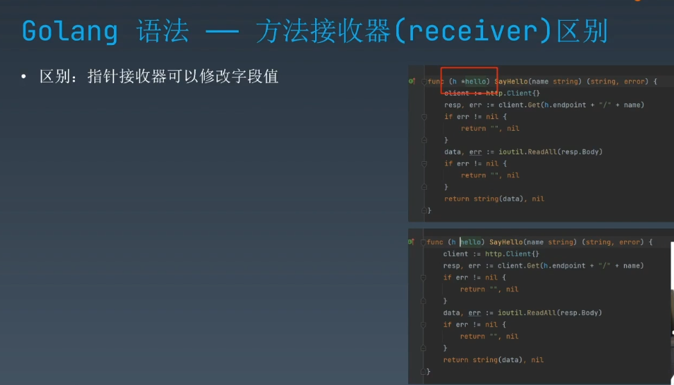

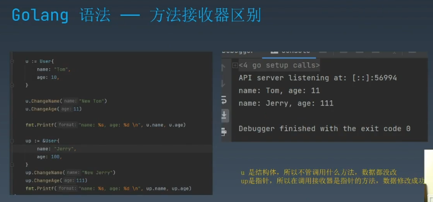


## 不加指针的

```go
package main

import "fmt"

type User struct {
	Name string
	Age  int
}

func (u User) ChangeName(newName string) {
	u.Name = newName
}

func (u User) ChangeAge(newAge int) {
	u.Age = newAge

}

func main() {
	u:=User{
		Name: "TOm",
		Age:  18,
	}

	u.ChangeName("Jerry")
	u.ChangeAge(17)

	fmt.Println(u.Name)
	fmt.Println(u.Age)


}
```

```cmd
TOm
18

Process finished with the exit code 0
```


## 带上指针的

```go
package main

import "fmt"

type User struct {
	Name string
	Age  int
}

func (u *User) ChangeName(newName string) {
	u.Name = newName
}

func (u *User) ChangeAge(newAge int) {
	u.Age = newAge

}

func main() {
	u:=User{
		Name: "TOm",
		Age:  18,
	}

	u.ChangeName("Jerry")
	u.ChangeAge(17)

	fmt.Println(u.Name)
	fmt.Println(u.Age)


}
```

```cmd
Jerry
17

Process finished with the exit code 0
```

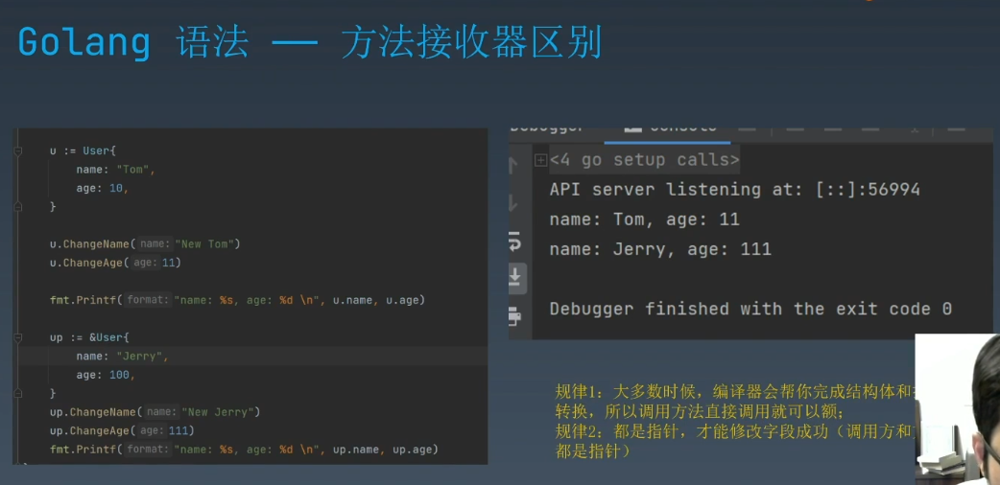

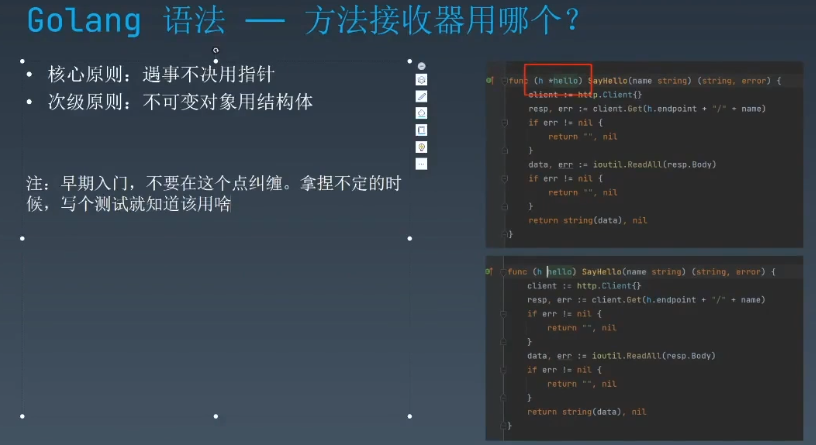

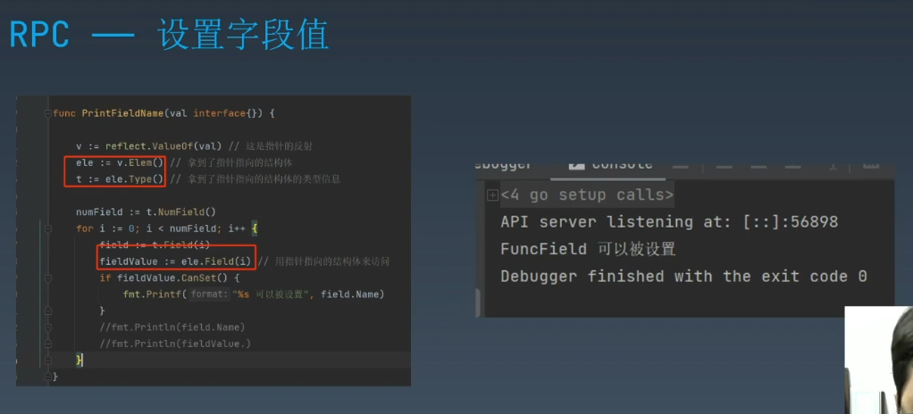

```go
package main

import (
	"fmt"
	"io/ioutil"
	"log"
	"net/http"
	"reflect"
)

func main() {
	var h = &hello{
		endpoint: "http://localhost:8080/",
	}
	msg, err := h.SayHello("够浪")
	if err != nil {
		log.Fatalf("%s", err)
		return
	}
	fmt.Print(msg)
	SetFuncField(h)
	h.FuncField()

}

// 远程调用的本质
//

func inn(addr string) func() {
	return func() {
		// 匿名函数
		fmt.Printf("change method begin\n")
		client := http.Client{}
		//resp, err := client.Get("http://localhost:8080/golang")
		resp, err := client.Get(addr)
		if err != nil {
			log.Fatalf("%s", err)
			//return "", err
		}
		data, err := ioutil.ReadAll(resp.Body)
		if err != nil {
			log.Fatalf("%s", err)
			//return "", err
		}
		print(data)
		//return string(data), nil
		fmt.Printf("change method end\n")
	}
}

// val interface{} >>> java 的 Object对象
// 跟对象
func SetFuncField(val interface{}) {
	//t:= reflect.TypeOf(val)
	v := reflect.ValueOf(val) // zhizhen指针的反射
	ele := v.Elem()           // 指针指向的结构体
	t := ele.Type()           // 指针指向的结构体的类型信息
	num := t.NumField()       // 方法数量
	for i := 0; i < num; i++ {
		f := ele.Field(i)
		if f.CanSet() {
			f.Set(
				reflect.ValueOf(inn("http://localhost:8080/golang2")))
			// todo 匿名函数如何传递参数
			//"http://localhost:8080/golang"
		}
		//m := t.Method(i)
		//fmt.Println(m.Name)
	}
	//t.MethodByName()
}

type HelloService interface {
	SayHello(name string) (string, error)
}

type hello struct {
	endpoint string
	// 只能改这个
	FuncField func()
}

func (h hello) SayHello(name string) (string, error) {
	client := http.Client{}
	resp, err := client.Get(h.endpoint + name)
	if err != nil {
		log.Fatalf("%s", err)
		return "", err
	}
	data, err := ioutil.ReadAll(resp.Body)
	if err != nil {
		log.Fatalf("%s", err)
		return "", err
	}
	return string(data), nil

}

```

> golang里面函数是一等公民

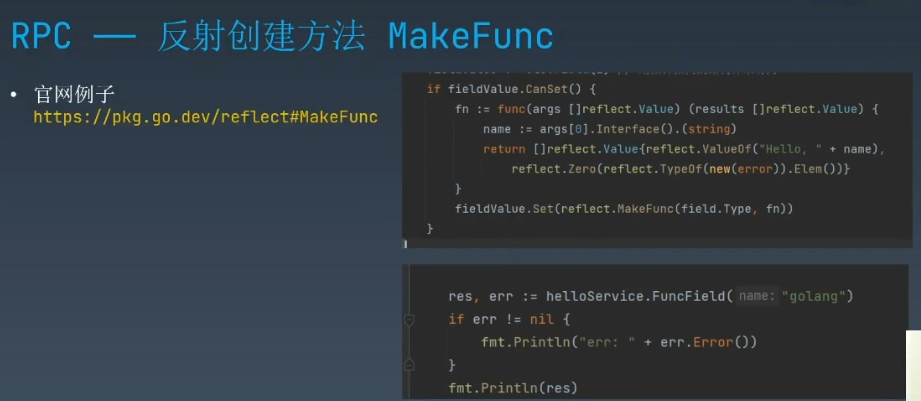

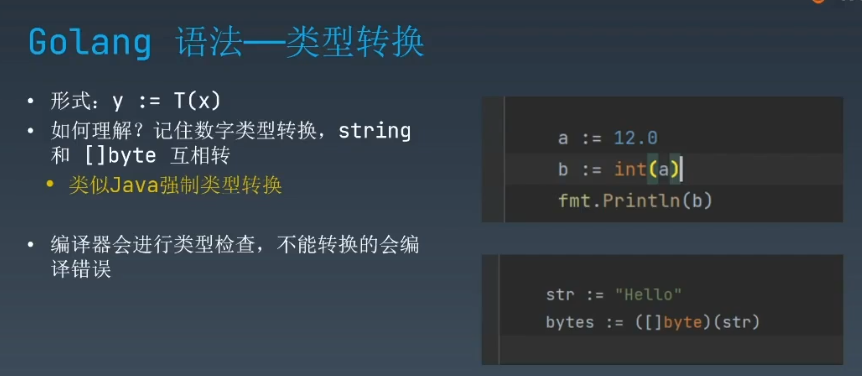

类型转换  类型断言

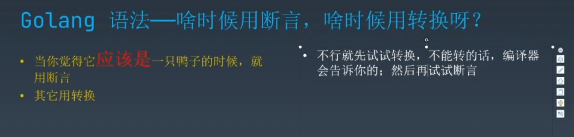

断言更加危险

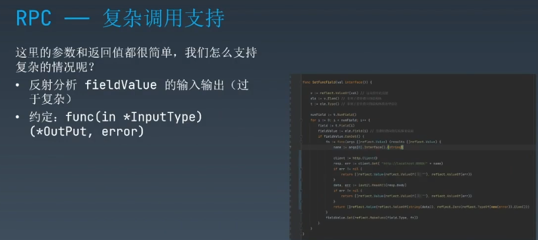

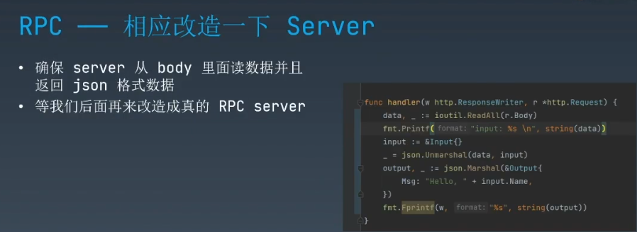

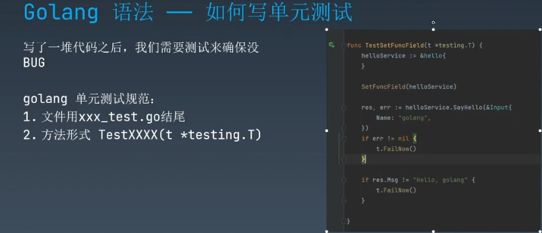

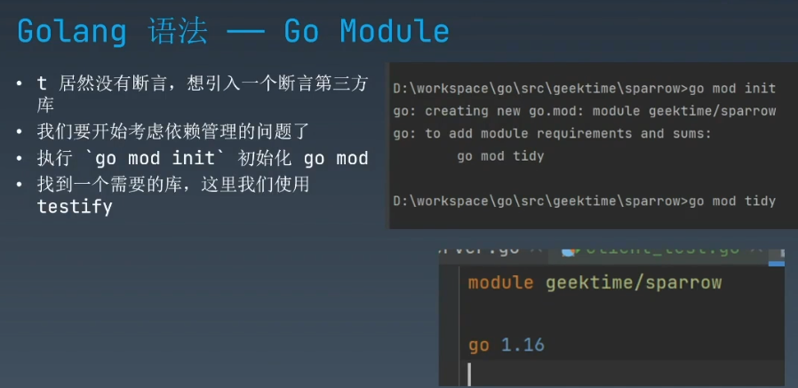

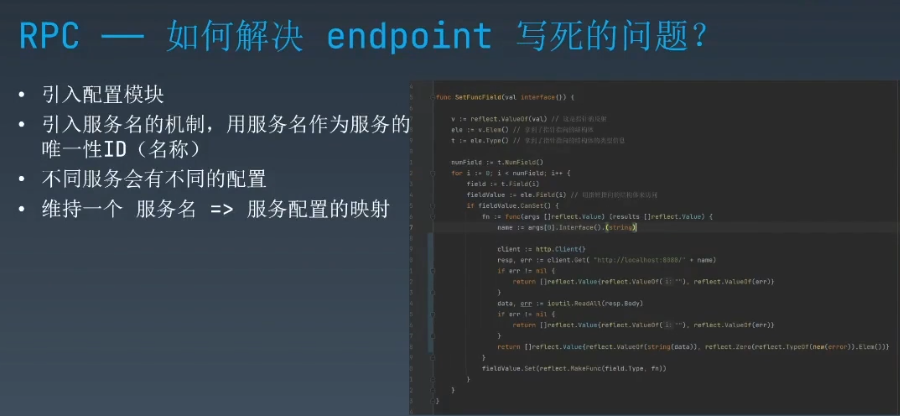

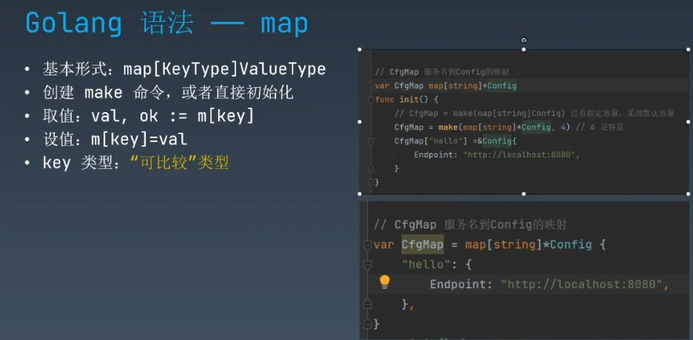

