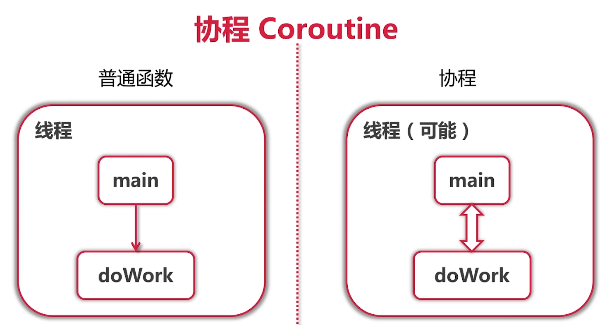
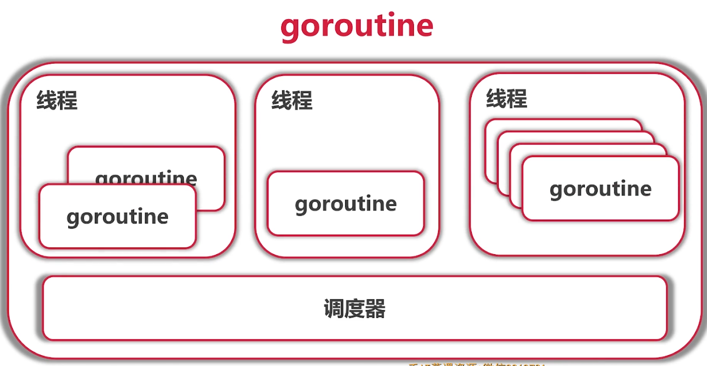
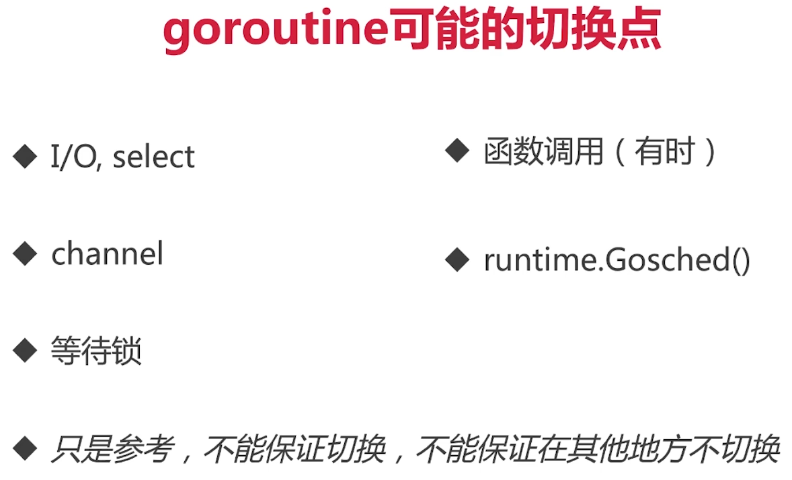

# 5-1 goroutine.mp4

```go
package main

import "fmt"

func main() {
	//fmt.Printf("hellow from goroutine %d")
	for i := 0; i < 10; i++ {
		go func(ii int) {
			for {
				fmt.Printf("hellow from goroutine %d\n", ii)
			}
		}(i)
	}
	select {}
}

```


携程

Coroutine

- 轻量级"线程"
- 非抢占式 多任务处理,由携程主动交出控制权


```go
package main

import (
	"fmt"
	"time"
)

func main() {
	//fmt.Printf("hellow from goroutine %d")
	var a [10]int
	for i := 0; i < 10; i++ {
		go func(i int) {
			for {
				a[i]++
				//fmt.Printf("hellow from goroutine %d\n", ii)
			}
		}(i)
	}
	time.Sleep(time.Millisecond)
	fmt.Println(a)
}
/**
[452860 456018 32360 77853 13509 368659 62929 151728 74805 319663]

Process finished with the exit code 0
 */
```


```go
package main

import (
	"fmt"
	"runtime"
	"time"
)

func main() {
	//fmt.Printf("hellow from goroutine %d")
	var a [10]int
	for i := 0; i < 10; i++ {
		go func(i int) {
			for {
				a[i]++
				//fmt.Printf("hellow from goroutine %d\n", ii)
				// 交出控制权
				runtime.Gosched()
			}
		}(i)
	}
	time.Sleep(time.Millisecond)
	fmt.Println(a)
}
/**
[655 669 635 667 532 582 608 503 578 539]

Process finished with the exit code 0
 */

```


> 不明觉厉,他们有什么区别???


如果不传递i

会发生:


```go
package main

import (
	"fmt"
	"runtime"
	"time"
)

func main() {
	//fmt.Printf("hellow from goroutine %d")
	var a [10]int
	for i := 0; i < 10; i++ {
		go func() {
			// race condition
			for {
				a[i]++
				//fmt.Printf("hellow from goroutine %d\n", ii)
				// 交出控制权
				runtime.Gosched()
			}
		}()
	}
	time.Sleep(time.Millisecond)
	fmt.Println(a)
}
/**
PS E:\Projects\GolandProjects\go-camp\mooc\code\learngo\goroutine> go run .\goroutine.go -race
panic: runtime error: index out of range [10] with length 10

goroutine 15 [running]:
main.main.func1()
        E:/Projects/GolandProjects/go-camp/mooc/code/learngo/goroutine/goroutine.go:16 +0x56
created by main.main
        E:/Projects/GolandProjects/go-camp/mooc/code/learngo/goroutine/goroutine.go:13 +0x57
panic: runtime error: index out of range [10] with length 10

goroutine 10 [running]:
main.main.func1()
        E:/Projects/GolandProjects/go-camp/mooc/code/learngo/goroutine/goroutine.go:16 +0x56
created by main.main
        E:/Projects/GolandProjects/go-camp/mooc/code/learngo/goroutine/goroutine.go:13 +0x57
exit status 2
PS E:\Projects\GolandProjects\go-camp\mooc\code\learngo\goroutine>

 */

```


# 5-2 go语言的调度器.mp4


## 携程特点

- 轻量级的线程
- **非抢占式**多任务处理,有携程主动交出控制权
- 编译器/解释器/虚拟机层面的多任务
- 多个携程可能在一个或者多个线程上运行








- 任何函数只需加上go就能送给调度器运行
- 不需要在定义时区分是否是异步函数
- 调度器在合适的点进行切换
- 使用-race来检测数据访问冲突





