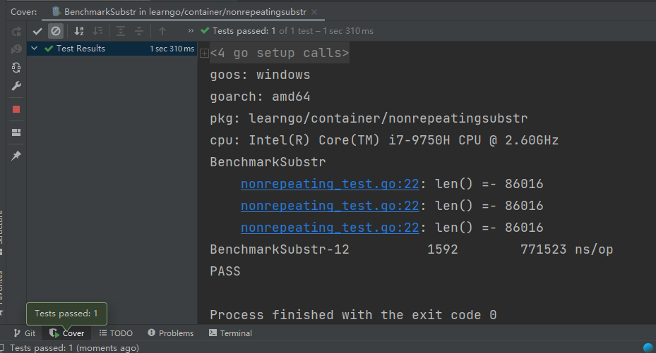
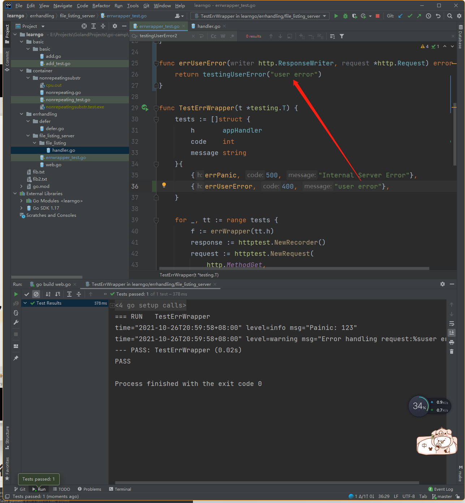

# 4-1测试.mp4


传统测试vs表格驱动测试


## 传统测试

- 测试数据和测试逻辑混在一起
- 出错信息不明确
- —旦一个数据出错测试全部结束

## 表格驱动测试


- 分离的测试数据和测试逻辑
- 明确的出错信息
- 可以部分失败
- go语言的语法使得我们更易实践表格驱动测试


```go
package main

import "testing"

func TestTriangle(t *testing.T){
	tests := []struct{a,b,c int	}{
		{3,4,5},
		{5,12,13},
		{8,15,17},
		{12,35,37},
		{30000,40000,52000},
	}

	for _,tt:=range tests{
		if actual:= calcTriangle(tt.a,tt.b); actual !=tt.c{
			t.Errorf("calcTriang %d %d got %d ; exceped",tt.a,tt.b,tt.c)
		}
	}
}

```


```cmd
=== RUN   TestTriangle
    add_test.go:16: calcTriang 30000 40000 got 52000 ; exceped
--- FAIL: TestTriangle (0.00s)

FAIL

Process finished with the exit code 1
```


# 4-2代码覆盖率和性能测试.mp4


```cmd
go test -coverprofile=c.out
go test -coverprofile=c.out .


go tool pprof cpu.out
go tool pprof -cpuprofile cpu.out

```


# 4-3使用pprof进行性能调优.mp4




# 4-4测试http服务器（上）.mp4




# 4-5测试http服务器（下）.mp4


```go
package main

import (
	"errors"
	"fmt"
	"io/ioutil"
	"net/http"
	"net/http/httptest"
	"os"
	"strings"
	"testing"
)

func errPanic(writer http.ResponseWriter, request *http.Request) error {
	panic(123)
}

type testingUserError string

func (e testingUserError) Error() string {
	return e.Message()
}

func (e testingUserError) Message() string {
	return string(e)
}

func errUserError(writer http.ResponseWriter, request *http.Request) error {
	return testingUserError("user error")
}

func errNotFound(writer http.ResponseWriter, request *http.Request) error {
	return os.ErrNotExist
}
func errNoPermission(writer http.ResponseWriter, request *http.Request) error {
	return os.ErrPermission
}
func errUnknown(writer http.ResponseWriter, request *http.Request) error {
	return errors.New("unknown error")
}

func noError(writer http.ResponseWriter, request *http.Request) error {
	fmt.Fprintln(writer, "no error")
	return nil
}

func TestErrWrapper(t *testing.T) {
	tests := []struct {
		h       appHandler
		code    int
		message string
	}{
		{errPanic, 500, "Internal Server Error"},
		{errUserError, 400, "user error"},
		{errNotFound, 404, "Not Found"},
		{errNoPermission, 403, "Forbidden"},
		{errUnknown, 500, "Internal Server Error"},
		{noError, 200, "no error"},
	}

	for _, tt := range tests {
		f := errWrapper(tt.h)
		response := httptest.NewRecorder()
		request := httptest.NewRequest(
			http.MethodGet,
			"http://localhost:8888/list/fib2.txt",
			nil,
		)
		f(response, request)
		b, _ := ioutil.ReadAll(response.Body)
		body := strings.Trim(string(b), "\n")
		if response.Code != tt.code ||
			body != tt.message {
			t.Errorf("expect (%d, %s)"+
				"expect (%d, %s);\"",
				tt.code,
				tt.message,
				response.Code,
				body,
			)
		}
	}
}

/**
=== RUN   TestErrWrapper
time="2021-10-26T20:55:25+08:00" level=info msg="Painic: 123"
--- PASS: TestErrWrapper (0.02s)
PASS

Process finished with the exit code 0

API server listening at: 127.0.0.1:50219
=== RUN   TestErrWrapper
--- PASS: TestErrWrapper (0.00s)
PASS

Debugger finished with the exit code 0

API server listening at: 127.0.0.1:50243
=== RUN   TestErrWrapper
--- PASS: TestErrWrapper (0.00s)
PASS

Debugger finished with the exit code 0

*/

```

> 函数是一等公民


```go

func TestErrWrapperInServer(t *testing.T) {
	for _, tt := range tests {
		f := errWrapper(tt.h)
		server := httptest.NewServer(
			http.HandlerFunc(f))
		resp, _ := http.Get(server.URL)
		b, _ := ioutil.ReadAll(resp.Body)
		body := strings.Trim(string(b), "\n")
		if resp.StatusCode != tt.code ||
			body != tt.message {
			t.Errorf("expect (%d, %s)"+
				"expect (%d, %s);\"",
				tt.code,
				tt.message,
				resp.StatusCode,
				body,
			)
		}
	}
}


/**
=== RUN   TestErrWrapperInServer
--- PASS: TestErrWrapperInServer (0.00s)
PASS

Process finished with the exit code 0
 */
```


- 通过testing库里面的 http假的request
  - 这种更像单元测试
- 通过启动http服务来进行测试
  - 这种更加的全面


# 4-6生成文档和示例代码.mp4