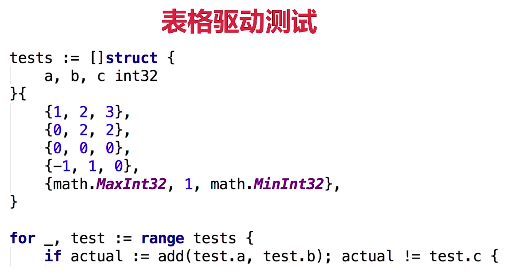

# 4-1测试.mp4


传统测试vs表格驱动测试


## 传统测试

- 测试数据和测试逻辑混在一起
- 出错信息不明确
- —旦一个数据出错测试全部结束

## 表格驱动测试




- 分离的测试数据和测试逻辑
- 明确的出错信息
- 可以部分失败
- go语言的语法使得我们更易实践表格驱动测试


```go
package main

import "testing"

func TestTriangle(t *testing.T){
	tests := []struct{a,b,c int	}{
		{3,4,5},
		{5,12,13},
		{8,15,17},
		{12,35,37},
		{30000,40000,52000},
	}

	for _,tt:=range tests{
		if actual:= calcTriangle(tt.a,tt.b); actual !=tt.c{
			t.Errorf("calcTriang %d %d got %d ; exceped",tt.a,tt.b,tt.c)
		}
	}
}

```


```cmd
=== RUN   TestTriangle
    add_test.go:16: calcTriang 30000 40000 got 52000 ; exceped
--- FAIL: TestTriangle (0.00s)

FAIL

Process finished with the exit code 1
```


# 4-2代码覆盖率和性能测试.mp4


# 4-3使用pprof进行性能调优.mp4


# 4-4测试http服务器（上）.mp4


# 4-5测试http服务器（下）.mp4


# 4-6生成文档和示例代码.mp4