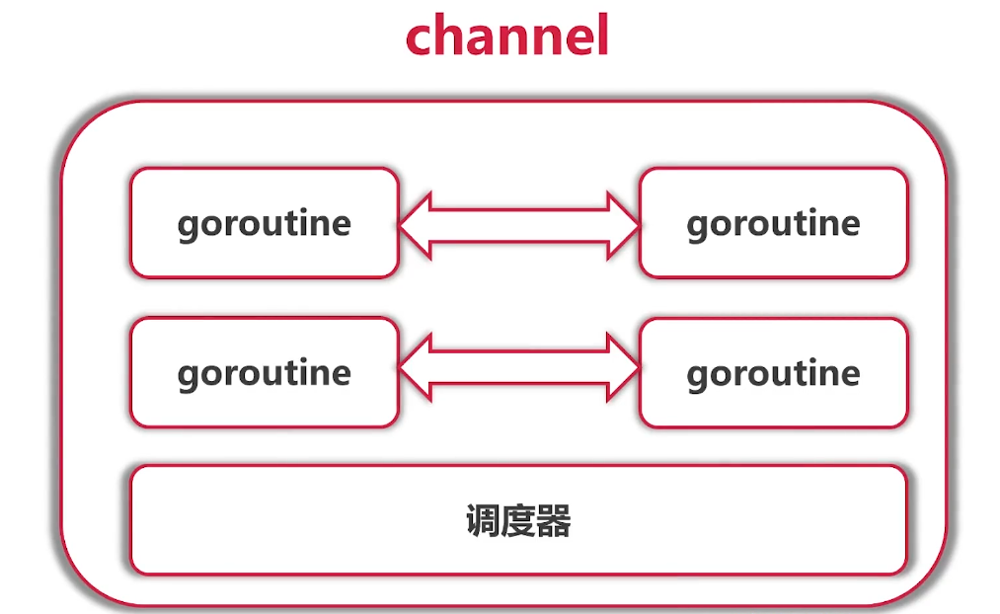
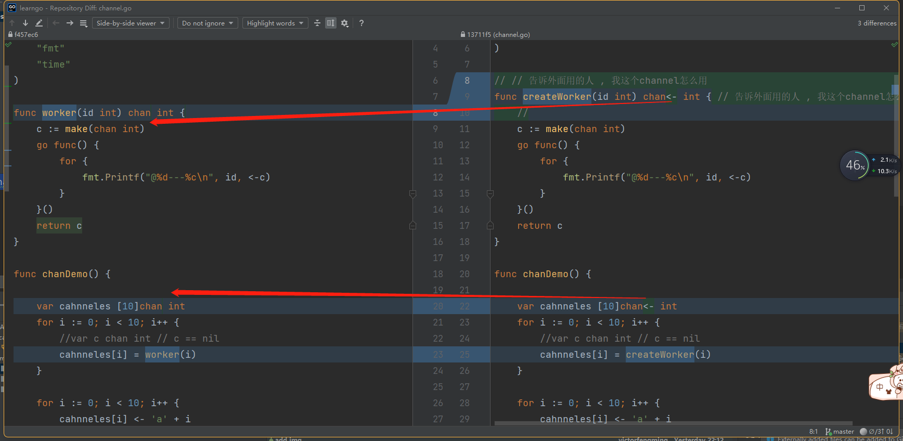

# 6-1 channel

## 代码案例

### code1 基本chan收发

```go
package main

import "fmt"

func chanDemo() {
	//var c chan int // c == nil
	c := make(chan int)
	c <- 1
	c <- 2
	c <- 3
	n:= <-c
	fmt.Println(n)

}

func main() {
	chanDemo()
}

/**
fatal error: all goroutines are asleep - deadlock!

goroutine 1 [chan send]:
main.chanDemo()
	E:/Projects/GolandProjects/go-camp/mooc/code/learngo/channel/channel.go:8 +0x37
main.main()
 */
```


> 死锁了

发的数据没人收是会deadlock的



### code2 加上等待,避免主线程停止而导致其他chan都被干掉

```go
package main

import (
	"fmt"
	"time"
)

func chanDemo() {
	//var c chan int // c == nil
	c := make(chan int)

	go func() {
		for  {
			n:= <- c
			fmt.Println(n)
		}
	}()

	c <- 1
	c <- 2
	//c <- 3
	//n := <-c
	//fmt.Println(n)
	time.Sleep(time.Millisecond)

}

func main() {
	chanDemo()
}

/**
1
2

Process finished with the exit code 0
*/

```


> go语言函数是一等公民

> go语言中的channel 也是一等公民

### code3 worker提取出来

```go
package main

import (
	"fmt"
	"time"
)

func worker(c chan int) {
	for {
		n := <-c
		fmt.Println(n)
	}
}

func chanDemo() {
	//var c chan int // c == nil
	c := make(chan int)

	go worker(c)

	c <- 1
	c <- 2
	//c <- 3
	//n := <-c
	//fmt.Println(n)
	time.Sleep(time.Millisecond)

}

func main() {
	chanDemo()
}

/**
1
2

Process finished with the exit code 0
*/

```


---


### code4 chan可以通过外部参数传递进来

```go
package main

import (
	"fmt"
	"time"
)

func worker(id int,c chan int) {
	for {
		fmt.Println(id,<-c)
	}
}

func chanDemo() {

	var cahnneles [10]chan int
	for i := 0; i < 10; i++ {
		//var c chan int // c == nil
		cahnneles[i] = make(chan int)
		go worker(i,cahnneles[i])
	}

	for i := 0; i < 10; i++ {
		cahnneles[i] <- 'a' + i
	}

	time.Sleep(time.Millisecond)

}

func main() {
	chanDemo()
}

/**
5 102
1 98
2 99
3 100
4 101
0 97
6 103
7 104
9 106
8 105

Process finished with the exit code 0

*/

```


在打印

### code5 格式化一下

```go
package main

import (
	"fmt"
	"time"
)

func worker(id int, c chan int) {
	for {
		fmt.Printf("%d,%c\n", id, <-c)
	}
}

func chanDemo() {

	var cahnneles [10]chan int
	for i := 0; i < 10; i++ {
		//var c chan int // c == nil
		cahnneles[i] = make(chan int)
		go worker(i, cahnneles[i])
	}

	for i := 0; i < 10; i++ {
		cahnneles[i] <- 'a' + i
	}
	for i := 0; i < 10; i++ {
		cahnneles[i] <- 'A' + i
	}
	time.Sleep(time.Millisecond)

}

func main() {
	chanDemo()
}

/**
5,f
2,c
0,a
1,b
3,d
0,A
1,B
9,j
8,i
4,e
4,E
3,D
7,h
2,C
6,g
6,G
7,H
9,J
5,F
8,I

Process finished with the exit code 0


*/

```

> goroutine 调度之后,先发的不一定会先收到

### code6 并发从chan读取

```go
package main

import (
	"fmt"
	"time"
)

func createWorker(id int) chan int {
	c := make(chan int)
	go func() {
		for {
			fmt.Printf("@%d---%c\n", id, <-c)
		}
	}()
	return c
}

func chanDemo() {

	var cahnneles [10]chan int
	for i := 0; i < 10; i++ {
		//var c chan int // c == nil
		cahnneles[i] = createWorker(i)
	}

	for i := 0; i < 10; i++ {
		cahnneles[i] <- 'a' + i
	}
	for i := 0; i < 10; i++ {
		cahnneles[i] <- 'A' + i
	}
	time.Sleep(time.Millisecond)

}

func main() {
	chanDemo()
}

/**

@0---a
@8---i
@1---b
@1---B
@3---d
@4---e
@5---f
@6---g
@7---h
@0---A
@9---j
@2---c
@2---C
@5---F
@6---G
@7---H
@3---D
@4---E
@9---J
@8---I

Process finished with the exit code 0

*/

```

> // // 告诉外面用的人 , 我这个channel怎么用




这样就不能收数据了,只能发 属性 (send-only type)

```go
//n:= <-cahnneles[i] 
// ↑ Invalid operation: <-cahnneles[i] (receive from the send-only type chan<- int)
```


---


### code7 chan<- int 只能够收/发 的类型 实现

```go
package main

import (
	"fmt"
	"time"
)

// // 告诉外面用的人 , 我这个channel怎么用
func createWorker(id int) chan<- int { // 告诉外面用的人 , 我这个channel怎么用
	//
	c := make(chan int)
	go func() {
		for {
			fmt.Printf("@%d---%c\n", id, <-c)
		}
	}()
	return c
}

func chanDemo() {

	var cahnneles [10]chan<- int
	for i := 0; i < 10; i++ {
		//var c chan int // c == nil
		cahnneles[i] = createWorker(i)
		//n:= <-cahnneles[i]
		// ↑ Invalid operation: <-cahnneles[i] (receive from the send-only type chan<- int)
	}

	for i := 0; i < 10; i++ {
		cahnneles[i] <- 'a' + i
	}
	for i := 0; i < 10; i++ {
		cahnneles[i] <- 'A' + i
	}
	time.Sleep(time.Millisecond)

}

func bufferedChannel() {
	c := make(chan int)
	c <- 1
}

func main() {
	//chanDemo()
	bufferedChannel()
}

/**
goroutine 1 [chan send]:
main.bufferedChannel(...)
	E:/Projects/GolandProjects/go-camp/mooc/code/learngo/channel/channel.go:42
main.main()
	E:/Projects/GolandProjects/go-camp/mooc/code/learngo/channel/channel.go:47 +0x31

Process finished with the exit code 2

 */

```


> 这样就是到4个 追加的时候才报错


### code8  加上缓冲区(指定长度) 

```go
func bufferedChannel() {
	// 加上缓冲区,大小为3
	c := make(chan int,3)
	c <- 1
	c <- 2
	c <- 3
	c <- 4

}
```


### code9 chan 不用同步收发了就 

```go
package main

import (
	"fmt"
	"time"
)

func worker(id int,c chan int) {
	for {
		fmt.Printf("@%d---%c\n", id, <-c)
	}
}


func bufferedChannel() {
	// 加上缓冲区,大小为3
	c := make(chan int,3)
	go worker(0,c)
	c <- '1'
	c <- '2'
	c <- '3'
	//c <- 4
	time.Sleep(time.Millisecond)


}

func main() {
	//chanDemo()
	bufferedChannel()
}

/**
@0---1
@0---2
@0---3

Process finished with the exit code 0

 */

```

> 告诉接收方,何时发完了


### code10 能够通过 err判断 chan是否 没消息了

```go
package main

import (
	"fmt"
	"time"
)

func worker(id int, c chan int) {
	for {
		n,ok := <-c
		if ok{
			fmt.Printf("@%d---%d\n", id,n)
		}else{
			break
		}
	}
}


func bufferedChannel() {
	// 加上缓冲区,大小为3
	c := make(chan int)
	go worker(0, c)
	c <- '1'
	c <- '2'
	c <- '3'
	c <- 'd'
	//c <- 4
	close(c)
	time.Sleep(time.Millisecond)

}

func main() {
	//chanDemo()
	bufferedChannel()
}

/**
@0---49
@0---50
@0---51
@0---100

Process finished with the exit code 0

*/

```


### code11 chan的for in 遍历

```go
func worker(id int, c chan int) {
	for n := range c {
		fmt.Printf("@%d---%d\n", id, n)
	}
}
// 这样也可以
```


## 理论channel

- channel
- buffered channel
- range
- 理论基础:Communication Sequential Process (CSP)

### go语言的创作者说

> go语言的创作者说:

Don't communicate by sharing memory; sharememory by communicating.

**不要通过共享内存来通讯;通过通信来共享内存**


# 6-2 使用Channel等待任务结束

**通过通信来共享内存**


## code01 顺序打印待修复

```
目前是按照顺序打印的
```

```go
package main

import (
	"fmt"
	"time"
)

func doWork(id int, c chan int, done chan bool) {
	for n := range c {
		fmt.Printf("@%d---%d\n", id, n)
		// 通知外面 做完了( channel 是一等公民)
		done <- true
	}
}

type worker struct {
	in   chan int
	done chan bool
}

// // 告诉外面用的人 , 我这个channel怎么用
func createWorker(id int) worker { // 告诉外面用的人 , 我这个channel怎么用
	//
	w := worker{
		in:   make(chan int),
		done: make(chan bool),
	}
	go doWork(id, w.in, w.done)
	return w
}

func chanDemo() {

	var workers [10]worker
	for i := 0; i < 10; i++ {
		workers[i] = createWorker(i)
	}

	for i := 0; i < 10; i++ {
		workers[i].in <- 'a' + i
		res := <-workers[i].done
		print(res)
	}
	for i := 0; i < 10; i++ {
		workers[i].in <- 'A' + i
		res := <-workers[i].done
		print(res)
	}
	time.Sleep(time.Second)

}

func main() {
	fmt.Println("Channel as first-class citizen")
	chanDemo()
	//bufferedChannel()
}

/**
Channel as first-class citizen
@0---97
@1---98
@2---99
@3---100
@4---101
@5---102
@6---103
@7---104
@8---105
@9---106
@0---65
@1---66
@2---67
@3---68
@4---69
@5---70
@6---71
@7---72
@8---73
@9---74
truetruetruetruetruetruetruetruetruetruetruetruetruetruetruetruetruetruetruetrue
Process finished with the exit code 0

*/

```


## code02 报错了

```go
package main

import (
	"fmt"
	"time"
)

func doWork(id int, c chan int, done chan bool) {
	for n := range c {
		fmt.Printf("@%d---%d\n", id, n)
		// 通知外面 做完了( channel 是一等公民)
		done <- true
	}
}

type worker struct {
	in   chan int
	done chan bool
}

// 告诉外面用的人 , 我这个channel怎么用
func createWorker(id int) worker { // 告诉外面用的人 , 我这个channel怎么用
	//
	w := worker{
		in:   make(chan int),
		done: make(chan bool),
	}
	go doWork(id, w.in, w.done)
	return w
}

func chanDemo() {

	var workers [10]worker
	for i := 0; i < 10; i++ {
		workers[i] = createWorker(i)
	}

	for i, w := range workers {
		w.in <- 'a' + i
		//res := <-workers[i].done
		//print(res)
	}
	for i, w := range workers {
		w.in <- 'A' + i
		//res := <-workers[i].done
		//print(res)
	}

	// wait for all of them
	for _, w := range workers {
		res := <-w.done
		res2 := <-w.done
		print(res)
		print(res2)
	}
	time.Sleep(time.Second)

}

func main() {
	fmt.Println("Channel as first-class citizen")
	chanDemo()
}

/**
Channel as first-class citizen
@0---97
@4---101
@2---99
@3---100
@9---106
@5---102
@6---103
@8---105
@7---104
@1---98
fatal error: all goroutines are asleep - deadlock!

goroutine 1 [chan send]:
main.chanDemo()
	E:/Projects/GolandProjects/go-camp/mooc/code/learngo/channel/done/channel.go:45 +0x15d
main.main()
	E:/Projects/GolandProjects/go-camp/mooc/code/learngo/channel/done/channel.go:63 +0x57

goroutine 6 [chan send]:


*/

```

> 大写字母那部分,发完了,没有来接收的,发会阻塞住

> 因为 channel 没有长度


## code03 等待的也 开goroutine

```go
func doWork(id int, c chan int, done chan bool) {
	for n := range c {
		fmt.Printf("@%d---%d\n", id, n)
		// 通知外面 做完了( channel 是一等公民)
		go func() {
			done <- true
		}()
	}
}
//这样就可以了
```

> 这是因为我们需要等2次,如果我们只是等一次就不用的


## code04 waitgroup方式来进行判断

```go
package main

import (
	"fmt"
	"sync"
	//"time"
)

func doWork(
	id int, c chan int, wg *sync.WaitGroup,
) {
	for n := range c {
		fmt.Printf("@%d---%d\n", id, n)
		// 通知外面 做完了( channel 是一等公民)
		wg.Done()
	}
}

type worker struct {
	in chan int
	wg *sync.WaitGroup
}

// 告诉外面用的人 , 我这个channel怎么用
func createWorker(id int, wg *sync.WaitGroup) worker { // 告诉外面用的人 , 我这个channel怎么用
	//
	w := worker{
		in: make(chan int),
		wg: wg,
	}
	go doWork(id, w.in, wg)
	return w
}

func chanDemo() {

	var wg sync.WaitGroup

	var workers [10]worker
	for i := 0; i < 10; i++ {
		workers[i] = createWorker(i, &wg)
	}
	wg.Add(20)

	for i, w := range workers {
		w.in <- 'a' + i
		//wg.Add(1)

	}
	for i, w := range workers {
		w.in <- 'A' + i
	}

	// wait for all of themtime.Sleep(time.Second)
	wg.Wait()

}

func main() {
	fmt.Println("Channel as first-class citizen")
	chanDemo()
}

/**
Channel as first-class citizen
@0---97
@4---101
@2---99
@3---100
@9---106
@5---102
@6---103
@8---105
@7---104
@1---98
fatal error: all goroutines are asleep - deadlock!

goroutine 1 [chan send]:
main.chanDemo()
	E:/Projects/GolandProjects/go-camp/mooc/code/learngo/channel/done/channel.go:45 +0x15d
main.main()
	E:/Projects/GolandProjects/go-camp/mooc/code/learngo/channel/done/channel.go:63 +0x57

goroutine 6 [chan send]:


*/

```


## code05 函数是一等公民之再次改进

```go
package main

import (
	"fmt"
	"sync"
	//"time"
)

func doWork(id int, w worker) {
	for n := range w.in {
		fmt.Printf("@%d---%d\n", id, n)
		// 通知外面 做完了( channel 是一等公民)
		w.done()
	}
}

type worker struct {
	in   chan int
	done func()
}

// 告诉外面用的人 , 我这个channel怎么用
func createWorker(id int, wg *sync.WaitGroup) worker { // 告诉外面用的人 , 我这个channel怎么用
	//
	w := worker{
		in: make(chan int),
		// 函数式编程 
		// 匿名函数来赋值
		done: func() {
			wg.Done()
		},
	}
	go doWork(id, w)
	return w
}

func chanDemo() {

	var wg sync.WaitGroup

	var workers [10]worker
	for i := 0; i < 10; i++ {
		workers[i] = createWorker(i, &wg)
	}
	wg.Add(20)

	for i, w := range workers {
		w.in <- 'a' + i
		//wg.Add(1)

	}
	for i, w := range workers {
		w.in <- 'A' + i
	}

	// wait for all of themtime.Sleep(time.Second)
	wg.Wait()

}

func main() {
	fmt.Println("Channel as first-class citizen")
	chanDemo()
}

/**
Channel as first-class citizen
@0---97
@1---98
@2---99
@2---67
@3---100
@3---68
@4---101
@4---69
@5---102
@5---70
@6---103
@6---71
@7---104
@7---72
@8---105
@8---73
@9---106
@9---74
@0---65
@1---66

Process finished with the exit code 0


*/
 
```


# 6-3 使用Channel进行树的遍历


## code01

```go
package tree

import "fmt"

type Node struct {
	Value       int
	Left, Right *Node
}

func (node Node) Print() {
	fmt.Print(node.Value, " ")
}

func (node *Node) SetValue(value int) {
	if node == nil {
		fmt.Println("Setting Value to nil " +
			"node. Ignored.")
		return
	}
	node.Value = value
}

func CreateNode(value int) *Node {
	return &Node{Value: value}
}

```


```go
package tree

import "fmt"

func (node *Node) Traverse() {
	node.TraverseFunc(func(n *Node) {
		n.Print()
	})
	fmt.Println()
}

func (node *Node) TraverseFunc(f func(*Node)) {
	if node == nil {
		return
	}

	node.Left.TraverseFunc(f)
	f(node)
	node.Right.TraverseFunc(f)
}

func (node *Node) TraverseWithChannel() chan *Node {
	out := make(chan *Node)
	go func() {
		node.TraverseFunc(func(node *Node) {
			out <- node
		})
		close(out)
	}()
	return out
}

```


# 6-4 Select

使用select 进行调度


## code1 非阻塞式的处理

```go
package main

import "fmt"

func main() {
	var c1, c2 chan int
	select {
	case n := <-c1:
		fmt.Println("received from c1:", n)
	case n := <-c2:
		fmt.Println("received from c2:", n)
	default:
		fmt.Println("no val received")
	}

}
/**
no val received

Process finished with the exit code 0
非阻塞式的处理
 */

```


## code02 死循环

```go
func main() {
	var c1, c2 chan int
	for {
		select {
		case n := <-c1:
			fmt.Println("received from c1:", n)
		case n := <-c2:
			fmt.Println("received from c2:", n)
		default:
			fmt.Println("no val received")
		}
	}

}
```

## code03 改进


```go
package main

import (
	"fmt"
	"math/rand"
	"time"
)

func generator() chan int {
	out := make(chan int)
	go func() {
		i := 0
		for {
			time.Sleep(
				time.Duration(rand.Intn(1500)) * time.Millisecond,
			)
			out <- i
			i++
		}
	}()
	return out
}

func main() {
	var c1, c2 = generator(), generator()
	for {
		select {
		case n := <-c1:
			fmt.Println("received from c1:", n)
		case n := <-c2:
			fmt.Println("received from c2:", n)
		//default:
		//	fmt.Println("no val received")
		}
	}

}

/**
received from c1: 0
received from c2: 0
received from c2: 1
received from c1: 1
received from c1: 2
received from c2: 2
received from c1: 3
received from c2: 3
received from c2: 4
received from c2: 5
received from c1: 4
received from c1: 5
received from c1: 6
received from c2: 6
received from c1: 7
received from c2: 7
received from c1: 8

Process finished with the exit code -1073741510 (0xC000013A: interrupted by Ctrl+C)

*/

```


# 6-5 传统同步机制


# 6-6 并发模式（上）


# 6-7 并发模式（下）


# 6-8 并发任务的控制