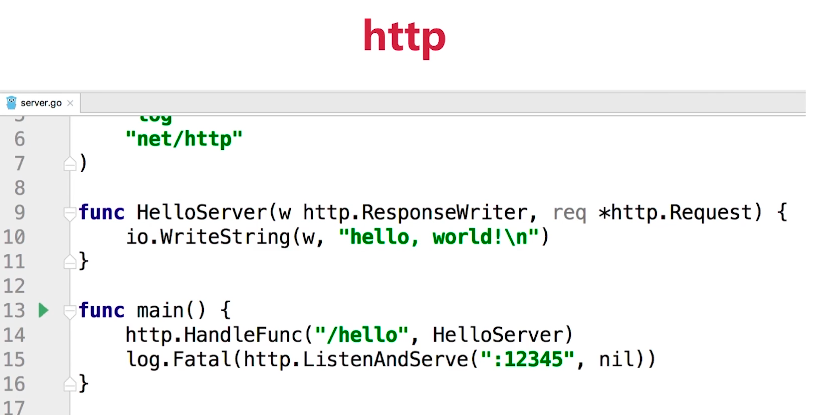
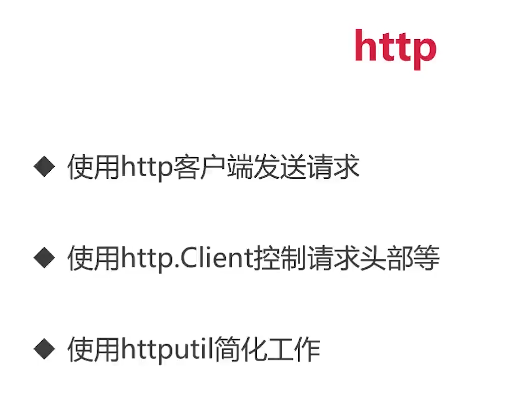
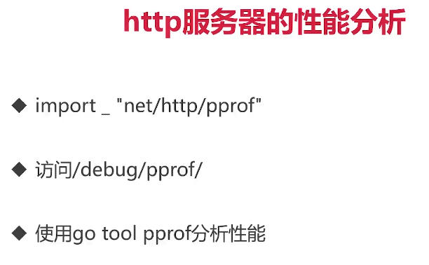

[[[]


# 8-1 http标准库




 ```go
package main

import (
	"fmt"
	"net/http"
	"net/http/httputil"
)

func main() {
	resp, err := http.Get("http://www.imooc.com")
	if err != nil {
		panic(err)
	}

	defer resp.Body.Close()

	response, err := httputil.DumpResponse(resp, true)
	if err != nil {
		panic(err)
	}

	fmt.Printf("%s\n", response)

}

 ```


> 我现在想对 httpclinet进行控制
>
> 比如我想要访问手机版的imooc


```go
package main

import (
	"fmt"
	"net/http"
	"net/http/httputil"
)

func main() {

	request, err := http.NewRequest(
		http.MethodGet,
		"http://www.imooc.com",
		nil,
	)
	request.Header.Add("User-Agent","Mozilla/5.0 (iPhone; CPU iPhone OS 13_2_3 like Mac OS X) AppleWebKit/605.1.15 (KHTML, like Gecko) Version/13.0.3 Mobile/15E148 Safari/604.1")
	resp, err := http.DefaultClient.Do(request)
	if err != nil {
		panic(err)
	}

	defer resp.Body.Close()

	response, err := httputil.DumpResponse(resp, true)
	if err != nil {
		panic(err)
	}

	fmt.Printf("%s\n", response)

}

```






# 8-2 json数据格式的处理


## +v格式化打印

```go
package main

import "fmt"

type Order struct {
	Id string
	Name string
	Quantity int
	TotalPrice int
}

func main() {
	o:=Order{
		Id:         "124",
		Name:       "lreag go",
		Quantity:   3,
		TotalPrice: 30,
	}

	fmt.Printf("%+v",o)

}

```


## 使用 json库 格式化库


```go
package main

import (
	"encoding/json"
	"fmt"
)

type Order struct {
	Id string
	Name string
	Quantity int
	TotalPrice int
}

func main() {
	o:=Order{
		Id:         "124",
		Name:       "lreag go",
		Quantity:   3,
		TotalPrice: 30,
	}

	//fmt.Printf("%+v",o)

	b,err:=json.Marshal(o)
	if err != nil {
		panic(err)
	}
	fmt.Printf("%s\n",b)
}

```

## json字段

```go
package main

import (
	"encoding/json"
	"fmt"
)

type Order struct {
	Id string `json:"id"`
	Name string `json:"name"`
	Quantity int `json:"quantity"`
	TotalPrice int`json:"total_price"`
}

func main() {
	o:=Order{
		Id:         "124",
		Name:       "lreag go",
		Quantity:   3,
		TotalPrice: 30,
	}

	//fmt.Printf("%+v",o)

	b,err:=json.Marshal(o)
	if err != nil {
		panic(err)
	}
	fmt.Printf("%s\n",b)
}
 
```

> 在结构体里面,首字母小写的字段是不能被看到的


## 省略空字段


```go
package main

import (
	"encoding/json"
	"fmt"
)

type Order struct {
	Id         string `json:"id"`
	Name       string `json:"name,omitempty"`
	Quantity   int    `json:"quantity"`
	TotalPrice int    `json:"total_price"`
}

func main() {
	o := Order{
		Id:         "124",
		//Name:       "lreag go",
		Quantity:   3,
		TotalPrice: 30,
	}

	//fmt.Printf("%+v",o)

	b, err := json.Marshal(o)
	if err != nil {
		panic(err)
	}
	fmt.Printf("%s\n", b)
}
/**
{"id":"124","quantity":3,"total_price":30}

Process finished with the exit code 0
 */
```


## json 嵌套

```go
package main

import (
	"encoding/json"
	"fmt"
)

type OrderItem struct {
	ID    string  `json:"id"`
	Name  string  `json:"name"`
	Price float64 `json:"price"`
}
type Order struct {
	Id         string `json:"id"`
	Item       OrderItem `json:"item"`
	Quantity   int `json:"quantity"`
	TotalPrice int `json:"total_price"`
}

func main() {
	o := Order{
		Id: "124",
		Item: OrderItem{
			ID:    "8675645",
			Name:  "nancy",
			Price: 0,
		},
		Quantity:   3,
		TotalPrice: 30,
	}

	//fmt.Printf("%+v",o)

	b, err := json.Marshal(o)
	if err != nil {
		panic(err)
	}
	fmt.Printf("%s\n", b)
}

/**
{
  "id": "124",
  "item": {
    "id": "8675645",
    "name": "nancy",
    "price": 0
  },
  "quantity": 3,
  "total_price": 30
}

*/

```


## 指针也可以

```go
package main

import (
	"encoding/json"
	"fmt"
)

type OrderItem struct {
	ID    string  `json:"id"`
	Name  string  `json:"name"`
	Price float64 `json:"price"`
}
type Order struct {
	Id         string `json:"id"`
	Item       *OrderItem `json:"item"`
	Quantity   int `json:"quantity"`
	TotalPrice int `json:"total_price"`
}

func main() {
	o := Order{
		Id: "124",
		Item: &OrderItem{
			ID:    "8675645",
			Name:  "nancy",
			Price: 0,
		},
		Quantity:   3,
		TotalPrice: 30,
	}

	//fmt.Printf("%+v",o)

	b, err := json.Marshal(o)
	if err != nil {
		panic(err)
	}
	fmt.Printf("%s\n", b)
}

/**
{
  "id": "124",
  "item": {
    "id": "8675645",
    "name": "nancy",
    "price": 0
  },
  "quantity": 3,
  "total_price": 30
}

*/

```

## 切片也支持


```go
package main

import (
	"encoding/json"
	"fmt"
)

type OrderItem struct {
	ID    string  `json:"id"`
	Name  string  `json:"name"`
	Price float64 `json:"price"`
}
type Order struct {
	Id         string `json:"id"`
	Item       *[]OrderItem `json:"item"`
	Quantity   int `json:"quantity"`
	TotalPrice int `json:"total_price"`
}

func main() {
	o := Order{
		Id: "124",
		Item: &[]OrderItem{
			{
				ID:    "8675645",
				Name:  "nancy",
				Price: 50,
			},
			{
				ID:    "2456733",
				Name:  "yael",
				Price: 20,
			},
		},
		Quantity:   3,
		TotalPrice: 30,
	}

	//fmt.Printf("%+v",o)

	b, err := json.Marshal(o)
	if err != nil {
		panic(err)
	}
	fmt.Printf("%s\n", b)
}

/**
{
  "id": "124",
  "item": [
    {
      "id": "8675645",
      "name": "nancy",
      "price": 50
    },
    {
      "id": "2456733",
      "name": "yael",
      "price": 20
    }
  ],
  "quantity": 3,
  "total_price": 30
}

*/

```


# 8-3 第三方API数据格式的解析技巧


# 8-4 gin框架介绍


# 8-5 为gin增加middleware