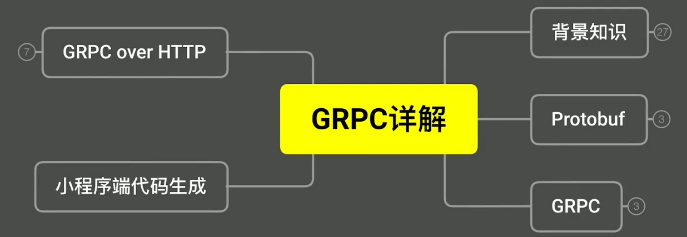
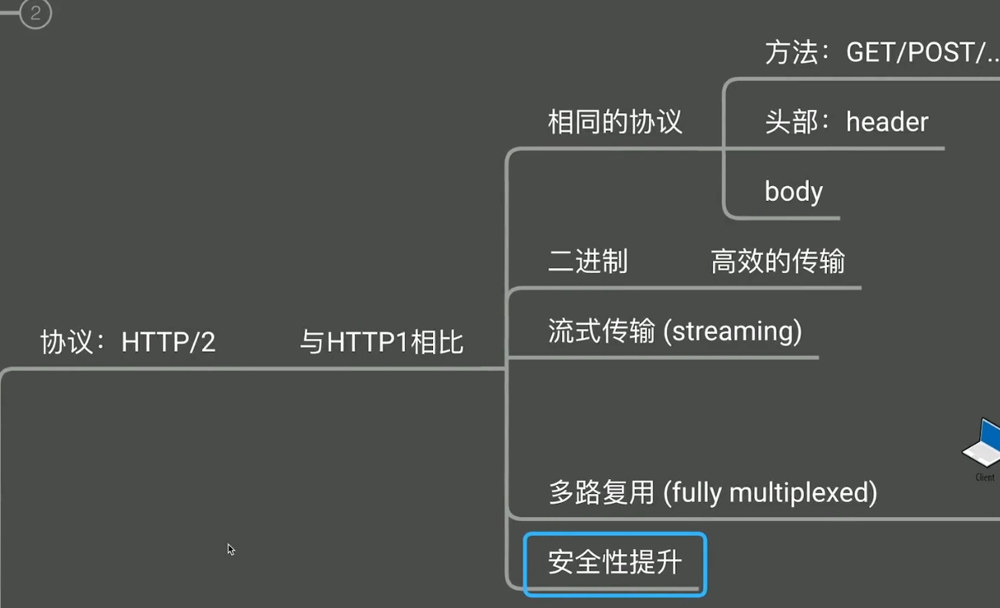

# 







## Protocol Buffer


trip.proto 文件:

```proto
syntax = "proto3";
package coolcar;
option go_package="server/proto/gen/go;trippb";

message Trip{
    string start = 1;   // 第一个字段是 start
    string end = 2;     // 第二个字段是 end
    int64 duration_sec = 3; // duration in second
    int64 fee_cent = 4;
}
```


```cmd
protoc -I=. --go_out=path=source_relative:gen/go 
```

```cmd
protoc -I=E:\Projects\GolandProjects\go-camp\mooc\code\coolcar\server\proto --go_out=paths=source_relative:gen/go trip.proto
```

终于生成出来了


```go
// Code generated by protoc-gen-go. DO NOT EDIT.
// versions:
// 	protoc-gen-go v1.27.1
// 	protoc        v3.13.0
// source: trip.proto

package trippb

import (
	protoreflect "google.golang.org/protobuf/reflect/protoreflect"
	protoimpl "google.golang.org/protobuf/runtime/protoimpl"
	reflect "reflect"
	sync "sync"
)

const (
	// Verify that this generated code is sufficiently up-to-date.
	_ = protoimpl.EnforceVersion(20 - protoimpl.MinVersion)
	// Verify that runtime/protoimpl is sufficiently up-to-date.
	_ = protoimpl.EnforceVersion(protoimpl.MaxVersion - 20)
)

type Trip struct {
	// 小写的不用管它
	state         protoimpl.MessageState
	sizeCache     protoimpl.SizeCache
	unknownFields protoimpl.UnknownFields

	// go 会自动把 _ 分隔 转成 驼峰吗命名
	Start       string `protobuf:"bytes,1,opt,name=start,proto3" json:"start,omitempty"`                                 // 第一个字段是 start
	End         string `protobuf:"bytes,2,opt,name=end,proto3" json:"end,omitempty"`                                     // 第二个字段是 end
	DurationSec int64  `protobuf:"varint,3,opt,name=duration_sec,json=durationSec,proto3" json:"duration_sec,omitempty"` // duration in second
	FeeCent     int64  `protobuf:"varint,4,opt,name=fee_cent,json=feeCent,proto3" json:"fee_cent,omitempty"`
}

func (x *Trip) Reset() {
	*x = Trip{}
	if protoimpl.UnsafeEnabled {
		mi := &file_trip_proto_msgTypes[0]
		ms := protoimpl.X.MessageStateOf(protoimpl.Pointer(x))
		ms.StoreMessageInfo(mi)
	}
}

func (x *Trip) String() string {
	return protoimpl.X.MessageStringOf(x)
}

func (*Trip) ProtoMessage() {}

func (x *Trip) ProtoReflect() protoreflect.Message {
	mi := &file_trip_proto_msgTypes[0]
	if protoimpl.UnsafeEnabled && x != nil {
		ms := protoimpl.X.MessageStateOf(protoimpl.Pointer(x))
		if ms.LoadMessageInfo() == nil {
			ms.StoreMessageInfo(mi)
		}
		return ms
	}
	return mi.MessageOf(x)
}

// Deprecated: Use Trip.ProtoReflect.Descriptor instead.
func (*Trip) Descriptor() ([]byte, []int) {
	return file_trip_proto_rawDescGZIP(), []int{0}
}

func (x *Trip) GetStart() string {
	if x != nil {
		return x.Start
	}
	return ""
}

func (x *Trip) GetEnd() string {
	if x != nil {
		return x.End
	}
	return ""
}

func (x *Trip) GetDurationSec() int64 {
	if x != nil {
		return x.DurationSec
	}
	return 0
}

func (x *Trip) GetFeeCent() int64 {
	if x != nil {
		return x.FeeCent
	}
	return 0
}

var File_trip_proto protoreflect.FileDescriptor

var file_trip_proto_rawDesc = []byte{
	0x0a, 0x0a, 0x74, 0x72, 0x69, 0x70, 0x2e, 0x70, 0x72, 0x6f, 0x74, 0x6f, 0x12, 0x07, 0x63, 0x6f,
	0x6f, 0x6c, 0x63, 0x61, 0x72, 0x22, 0x6c, 0x0a, 0x04, 0x54, 0x72, 0x69, 0x70, 0x12, 0x14, 0x0a,
	0x05, 0x73, 0x74, 0x61, 0x72, 0x74, 0x18, 0x01, 0x20, 0x01, 0x28, 0x09, 0x52, 0x05, 0x73, 0x74,
	0x61, 0x72, 0x74, 0x12, 0x10, 0x0a, 0x03, 0x65, 0x6e, 0x64, 0x18, 0x02, 0x20, 0x01, 0x28, 0x09,
	0x52, 0x03, 0x65, 0x6e, 0x64, 0x12, 0x21, 0x0a, 0x0c, 0x64, 0x75, 0x72, 0x61, 0x74, 0x69, 0x6f,
	0x6e, 0x5f, 0x73, 0x65, 0x63, 0x18, 0x03, 0x20, 0x01, 0x28, 0x03, 0x52, 0x0b, 0x64, 0x75, 0x72,
	0x61, 0x74, 0x69, 0x6f, 0x6e, 0x53, 0x65, 0x63, 0x12, 0x19, 0x0a, 0x08, 0x66, 0x65, 0x65, 0x5f,
	0x63, 0x65, 0x6e, 0x74, 0x18, 0x04, 0x20, 0x01, 0x28, 0x03, 0x52, 0x07, 0x66, 0x65, 0x65, 0x43,
	0x65, 0x6e, 0x74, 0x42, 0x1c, 0x5a, 0x1a, 0x73, 0x65, 0x72, 0x76, 0x65, 0x72, 0x2f, 0x70, 0x72,
	0x6f, 0x74, 0x6f, 0x2f, 0x67, 0x65, 0x6e, 0x2f, 0x67, 0x6f, 0x3b, 0x74, 0x72, 0x69, 0x70, 0x70,
	0x62, 0x62, 0x06, 0x70, 0x72, 0x6f, 0x74, 0x6f, 0x33,
}

var (
	file_trip_proto_rawDescOnce sync.Once
	file_trip_proto_rawDescData = file_trip_proto_rawDesc
)

func file_trip_proto_rawDescGZIP() []byte {
	file_trip_proto_rawDescOnce.Do(func() {
		file_trip_proto_rawDescData = protoimpl.X.CompressGZIP(file_trip_proto_rawDescData)
	})
	return file_trip_proto_rawDescData
}

var file_trip_proto_msgTypes = make([]protoimpl.MessageInfo, 1)
var file_trip_proto_goTypes = []interface{}{
	(*Trip)(nil), // 0: coolcar.Trip
}
var file_trip_proto_depIdxs = []int32{
	0, // [0:0] is the sub-list for method output_type
	0, // [0:0] is the sub-list for method input_type
	0, // [0:0] is the sub-list for extension type_name
	0, // [0:0] is the sub-list for extension extendee
	0, // [0:0] is the sub-list for field type_name
}

func init() { file_trip_proto_init() }
func file_trip_proto_init() {
	if File_trip_proto != nil {
		return
	}
	if !protoimpl.UnsafeEnabled {
		file_trip_proto_msgTypes[0].Exporter = func(v interface{}, i int) interface{} {
			switch v := v.(*Trip); i {
			case 0:
				return &v.state
			case 1:
				return &v.sizeCache
			case 2:
				return &v.unknownFields
			default:
				return nil
			}
		}
	}
	type x struct{}
	out := protoimpl.TypeBuilder{
		File: protoimpl.DescBuilder{
			GoPackagePath: reflect.TypeOf(x{}).PkgPath(),
			RawDescriptor: file_trip_proto_rawDesc,
			NumEnums:      0,
			NumMessages:   1,
			NumExtensions: 0,
			NumServices:   0,
		},
		GoTypes:           file_trip_proto_goTypes,
		DependencyIndexes: file_trip_proto_depIdxs,
		MessageInfos:      file_trip_proto_msgTypes,
	}.Build()
	File_trip_proto = out.File
	file_trip_proto_rawDesc = nil
	file_trip_proto_goTypes = nil
	file_trip_proto_depIdxs = nil
}

```


protobuf 的所有字段 都是可选的


go中的零值


omit empty


动态增加字段,新老系统同时可用

默认字段不填,填的是零值


## grpc


```shell
protoc -I=E:\Projects\GolandProjects\go-camp\mooc\code\coolcar\server\proto --go_out=plugins=grpc,paths=source_relative:gen/go trip.proto
```


server


```go
package main

import (
	trippb "coolcar/proto/gen/go"
	trip "coolcar/tripservice"
	"google.golang.org/grpc"
	"log"
	"net"
)

func main() {
	lis, err := net.Listen("tcp", ":8081")
	if err != nil {
		log.Fatalf("failed to listen: %v", err)
	}

	s := grpc.NewServer()
	trippb.RegisterTripServiceServer(s, &trip.Service{})
	log.Fatal(s.Serve(lis))


}

```

client


```go

package main

import (
	"context"
	trippb "coolcar/proto/gen/go"
	"fmt"
	"google.golang.org/grpc"
	"log"
)

func main() {
	log.SetFlags(log.Lshortfile)
	conn, err := grpc.Dial("localhost:8081",grpc.WithInsecure())
	if err != nil {
		log.Fatalf("cannot connect server: %v", err)

	}

	tsClient := trippb.NewTripServiceClient(conn)
	r, err := tsClient.GetTrip(context.Background(), &trippb.GetTripRequest{
		Id: "tr35653",
	})
	if err != nil {
		log.Fatalf("can not call GetTrip : %v", err)
	}

	fmt.Println(r)
}

/**
id:"tr35653"  trip:{start:"abc"  start_pos:{latitude:30  longitude:120}  end_pos:{latitude:30  longitude:120}  path_locaitons:{latitude:31  longitude:118}  path_locaitons:{latitude:37  longitude:125}  status:IN_PROGRESS  end:"def"  duration_sec:36000  fee_cent:13000}

Process finished with the exit code 0
 */
```

