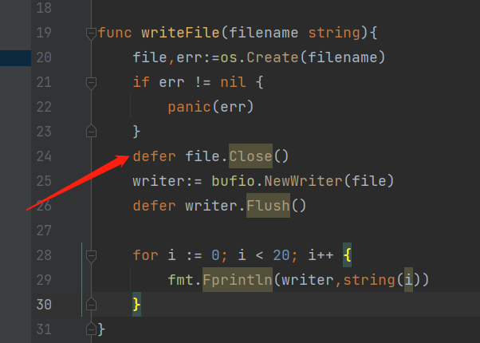
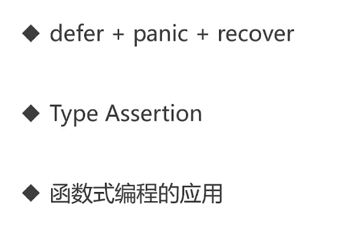

# 3-1 defer调用.mp4

```go
func writeFile(filename string){
	file,err:=os.Create(filename)
	if err != nil {
		panic(err)
	}
	defer file.Close()
	writer:= bufio.NewWriter(file)
	defer writer.Flush()

	for i := 0; i < 20; i++ {
		fmt.Fprintln(writer,string(i))
	}
}
```


等我代码写完了,我就忘记这个了

所以我就进就加一个这个





```go
package main

import (
	"bufio"
	"fmt"
	"os"
)

func tryDefer() {
	defer fmt.Println(2)
	defer fmt.Println(1)

	fmt.Println(3)
	fmt.Println(4)
}

func writeFile(filename string) {
	file, err := os.Create(filename)
	if err != nil {
		panic(err)
	}
	defer file.Close()
	writer := bufio.NewWriter(file)
	defer writer.Flush()

	for i := 0; i < 20; i++ {
		fmt.Fprintln(writer, i)
	}
}

func main() {
	writeFile("fib.txt")
}

```


# 3-2 错误处理概念.mp4

```go
package main

import (
	"bufio"
	"fmt"
	"os"
)

func tryDefer() {
	defer fmt.Println(2)
	defer fmt.Println(1)

	fmt.Println(3)
	fmt.Println(4)
}

func writeFile(filename string) {
	file, err := os.Create(filename)
	if err != nil {
		panic(err)
	}
	defer file.Close()
	writer := bufio.NewWriter(file)
	defer writer.Flush()

	for i := 0; i < 20; i++ {
		fmt.Fprintln(writer, i)
	}
}

func writeFile2(filename string) {
	file, err := os.OpenFile(
		filename, os.O_EXCL|os.O_CREATE, 0666)
	if err != nil {
		panic(err)
	}
	defer file.Close()
	writer := bufio.NewWriter(file)
	defer writer.Flush()

	for i := 0; i < 20; i++ {
		fmt.Fprintln(writer, i)
	}
}

func main() {
	writeFile2("fib.txt")
	/**
	panic: open fib.txt: The file exists.

	goroutine 1 [running]:
	main.writeFile2({0xf7b58, 0xc000040000})
		E:/Projects/GolandProjects/go-camp/mooc/code/learngo/errhandling/defer/defer.go:35 +0x1d5
	main.main()
		E:/Projects/GolandProjects/go-camp/mooc/code/learngo/errhandling/defer/defer.go:47 +0x25

	Process finished with the exit code 2
	 */
}

```


> 如果文件存在就报错

可以处理一下

```go
func writeFile2(filename string) {
	file, err := os.OpenFile(
		filename, os.O_EXCL|os.O_CREATE, 0666)
	if err != nil {
		fmt.Println("flie already exist!!!")
		return
	}
	defer file.Close()
	writer := bufio.NewWriter(file)
	defer writer.Flush()

	for i := 0; i < 20; i++ {
		fmt.Fprintln(writer, i)
	}
}
```


> 真正的处理错误

```go
func writeFile2(filename string) {
	file, err := os.OpenFile(
		filename, os.O_EXCL|os.O_CREATE, 0666)
	if err != nil {
		if pathError, ok := err.(*os.PathError); !ok {
			// 真的 不知道是森什么错了
			// 那就挂掉程序吧
			panic(err)
		} else {
			fmt.Printf("%s, %s, %s\n",
				pathError.Op,
				pathError.Path,
				pathError.Err,
			)
		}
		return
	}
	defer file.Close()
	writer := bufio.NewWriter(file)
	defer writer.Flush()

	for i := 0; i < 20; i++ {
		fmt.Fprintln(writer, i)
	}
}
```


# 3-3 服务器统一出错处理_浏览器需放大_.mp4


# 3-4 服务器统一出错处理.mp4

error vs panic

- 意料之中: 使用error . 如文件打不开
- 意料之外: 使用panic . 如数组越界





输入的参数类型是函数

输出的返回类型也是函数

